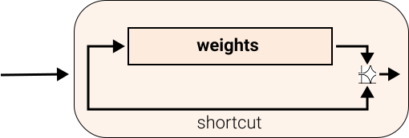
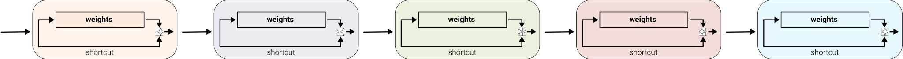
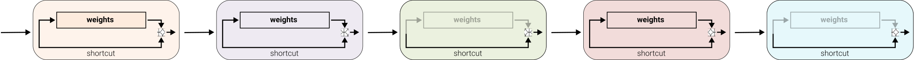

```python
%load_ext memory_profiler

```

# Implementing Stochastic Depth/Drop Path In PyTorch

DropPath is available on [glasses](https://github.com/FrancescoSaverioZuppichini/glasses) my computer vision library!

## Introduction
Today we are going to implement Stochastic Depth also known as Drop Path in PyTorch! [Stochastic Depth](https://arxiv.org/abs/1603.09382) introduced by Gao Huang et al is technique to "deactivate" some layers during training.  

Let's take a look at a normal ResNet Block that uses residual connections (like almost all models now).If you are not familiar with ResNet, I have an [article](https://towardsdatascience.com/residual-network-implementing-resnet-a7da63c7b278) showing how to implement it. 

Basically, the block's output is added to its input: `output = block(input) + input`. This is called a **residual connection**




Here we see four ResnNet like  blocks, one after the other. 



Stochastic Depth/Drop Path will deactivate some of the block's weight



The idea is to reduce the number of layers/block used during training, saving time and make the network generalize better. 

Practically, this means setting to zero the output of the block before adding.

## Implementation 
Let's start by importing our best friend, `torch`.


```python
import torch
from torch import nn
from torch import Tensor
```

We can define a 4D tensor (`batch x channels x height x width`), in our case let's just send 4 images with one pixel each :) 


```python
x = torch.ones((4, 1, 1, 1))
```

We need a tensor of shape `batch x 1 x 1 x 1` that will be used to set some of the elements in the batch to zero, using a given prob. Bernoulli to the rescue!


```python
keep_prob: float = .5
mask: Tensor = x.new_empty(x.shape[0], 1, 1, 1).bernoulli_(keep_prob)
    
mask
```


    tensor([[[[0.]]],
    
    
            [[[1.]]],
    
    
            [[[1.]]],
    
    
            [[[1.]]]])


Btw, this is equivelant to 


```python
mask: Tensor = (torch.rand(x.shape[0], 1, 1, 1) > keep_prob).float()
mask
```


    tensor([[[[1.]]],
    
    
            [[[1.]]],
    
    
            [[[1.]]],
    
    
            [[[1.]]]])


Before we multiply `x` by the `mask` we need to divide `x` by  `keep_prob` to rescale down the inputs activation during training, see [cs231n](https://cs231n.github.io/neural-networks-2/#reg). So


```python
x_scaled : Tensor = x / keep_prob
x_scaled
```


    tensor([[[[2.]]],
    
    
            [[[2.]]],
    
    
            [[[2.]]],
    
    
            [[[2.]]]])


Finally


```python
output: Tensor = x_scaled * mask
output
```


    tensor([[[[2.]]],
    
    
            [[[2.]]],
    
    
            [[[2.]]],
    
    
            [[[2.]]]])


We can put together in a function


```python
def drop_path(x: Tensor, keep_prob: float = 1.0) -> Tensor:
    mask: Tensor = x.new_empty(x.shape[0], 1, 1, 1).bernoulli_(keep_prob)
    x_scaled: Tensor = x / keep_prob
    return x_scaled * mask

drop_path(x, keep_prob=0.5)
```


    tensor([[[[0.]]],
    
    
            [[[0.]]],
    
    
            [[[2.]]],
    
    
            [[[0.]]]])


We can also do the operation in place 


```python
def drop_path(x: Tensor, keep_prob: float = 1.0) -> Tensor:
    mask: Tensor = x.new_empty(x.shape[0], 1, 1, 1).bernoulli_(keep_prob)
    x.div_(keep_prob)
    x.mul_(mask)
    return x


drop_path(x, keep_prob=0.5)
```


    tensor([[[[2.]]],
    
    
            [[[2.]]],
    
    
            [[[0.]]],
    
    
            [[[0.]]]])


However, we may want to use `x` somewhere else, and dividing `x` or `mask` by `keep_prob` is the same thing. Let's arrive at the final implementation


```python
def drop_path(x: Tensor, keep_prob: float = 1.0, inplace: bool = False) -> Tensor:
    mask: Tensor = x.new_empty(x.shape[0], 1, 1, 1).bernoulli_(keep_prob)
    mask.div_(keep_prob)
    if inplace:
        x.mul_(mask)
    else:
        x = x * mask
    return x

x = torch.ones((4, 1, 1, 1))
drop_path(x, keep_prob=0.8)
```


    tensor([[[[1.2500]]],
    
    
            [[[1.2500]]],
    
    
            [[[1.2500]]],
    
    
            [[[1.2500]]]])


`drop_path` only works for 2d data, we need to automatically calculate the number of dimensions from the input size to make it work for any data time


```python
def drop_path(x: Tensor, keep_prob: float = 1.0, inplace: bool = False) -> Tensor:
    mask_shape: Tuple[int] = (x.shape[0],) + (1,) * (x.ndim - 1) 
    # remember tuples have the * operator -> (1,) * 3 = (1,1,1)
    mask: Tensor = x.new_empty(mask_shape).bernoulli_(keep_prob)
    mask.div_(keep_prob)
    if inplace:
        x.mul_(mask)
    else:
        x = x * mask
    return x

x = torch.ones((4, 1))
drop_path(x, keep_prob=0.8)
```


    tensor([[0.],
            [0.],
            [0.],
            [0.]])


Let's create a nice `DropPath` `nn.Module`


```python
class DropPath(nn.Module):
    def __init__(self, p: float = 0.5, inplace: bool = False):
        super().__init__()
        self.p = p
        self.inplace = inplace

    def forward(self, x: Tensor) -> Tensor:
        if self.training and self.p > 0:
            x = drop_path(x, self.p, self.inplace)
        return x

    def __repr__(self):
        return f"{self.__class__.__name__}(p={self.p})"

    
DropPath()(torch.ones((4, 1)))
```


    tensor([[2.],
            [0.],
            [0.],
            [0.]])


## Usage with Residual Connections

We have our `DropPath`, cool but how do we use it? We need a classic ResNet block, let's implement our good old friend `BottleNeckBlock`


```python
from torch import nn


class ConvBnAct(nn.Sequential):
    def __init__(self, in_features: int, out_features: int, kernel_size=1):
        super().__init__(
            nn.Conv2d(in_features, out_features, kernel_size=kernel_size, padding=kernel_size // 2),
            nn.BatchNorm2d(out_features),
            nn.ReLU()
        )
         

class BottleNeck(nn.Module):
    def __init__(self, in_features: int, out_features: int, reduction: int = 4):
        super().__init__()
        self.block = nn.Sequential(
            # wide -> narrow
            ConvBnAct(in_features, out_features // reduction, kernel_size=1),
            # narrow -> narrow
            ConvBnAct( out_features // reduction, out_features // reduction, kernel_size=3),
            # wide -> narrow
            ConvBnAct( out_features // reduction, out_features, kernel_size=1),
        )
        # I am lazy, no shortcut etc
        
    def forward(self, x: Tensor) -> Tensor:
        res = x
        x = self.block(x)
        return x + res
    
    
BottleNeck(64, 64)(torch.ones((1,64, 28, 28))).shape
```


    torch.Size([1, 64, 28, 28])


To deactivate the block the operation `x + res` must be equal to `res`, so our `DropPath` has to be applied after the block.


```python
class BottleNeck(nn.Module):
    def __init__(self, in_features: int, out_features: int, reduction: int = 4):
        super().__init__()
        self.block = nn.Sequential(
            # wide -> narrow
            ConvBnAct(in_features, out_features // reduction, kernel_size=1),
            # narrow -> narrow
            ConvBnAct( out_features // reduction, out_features // reduction, kernel_size=3),
            # wide -> narrow
            ConvBnAct( out_features // reduction, out_features, kernel_size=1),
        )
        # I am lazy, no shortcut etc
        self.drop_path = DropPath()
        
    def forward(self, x: Tensor) -> Tensor:
        res = x
        x = self.block(x)
        x = self.drop_path(x)
        return x + res
    
BottleNeck(64, 64)(torch.ones((1,64, 28, 28)))
```


    tensor([[[[1.0009, 1.0000, 1.0000,  ..., 1.0000, 1.0000, 1.0000],
              [1.0134, 1.0034, 1.0034,  ..., 1.0034, 1.0034, 1.0000],
              [1.0134, 1.0034, 1.0034,  ..., 1.0034, 1.0034, 1.0000],
              ...,
              [1.0134, 1.0034, 1.0034,  ..., 1.0034, 1.0034, 1.0000],
              [1.0134, 1.0034, 1.0034,  ..., 1.0034, 1.0034, 1.0000],
              [1.0000, 1.0000, 1.0000,  ..., 1.0000, 1.0000, 1.0000]],
    
             [[1.0005, 1.0000, 1.0000,  ..., 1.0000, 1.0000, 1.0000],
              [1.0000, 1.0000, 1.0000,  ..., 1.0000, 1.0000, 1.0421],
              [1.0000, 1.0000, 1.0000,  ..., 1.0000, 1.0000, 1.0421],
              ...,
              [1.0000, 1.0000, 1.0000,  ..., 1.0000, 1.0000, 1.0421],
              [1.0000, 1.0000, 1.0000,  ..., 1.0000, 1.0000, 1.0421],
              [1.0000, 1.0011, 1.0011,  ..., 1.0011, 1.0011, 1.0247]],
    
             [[1.0203, 1.0123, 1.0123,  ..., 1.0123, 1.0123, 1.0299],
              [1.0000, 1.0005, 1.0005,  ..., 1.0005, 1.0005, 1.0548],
              [1.0000, 1.0005, 1.0005,  ..., 1.0005, 1.0005, 1.0548],
              ...,
              [1.0000, 1.0005, 1.0005,  ..., 1.0005, 1.0005, 1.0548],
              [1.0000, 1.0005, 1.0005,  ..., 1.0005, 1.0005, 1.0548],
              [1.0000, 1.0000, 1.0000,  ..., 1.0000, 1.0000, 1.0000]],
    
             ...,
    
             [[1.0011, 1.0180, 1.0180,  ..., 1.0180, 1.0180, 1.0465],
              [1.0000, 1.0000, 1.0000,  ..., 1.0000, 1.0000, 1.0245],
              [1.0000, 1.0000, 1.0000,  ..., 1.0000, 1.0000, 1.0245],
              ...,
              [1.0000, 1.0000, 1.0000,  ..., 1.0000, 1.0000, 1.0245],
              [1.0000, 1.0000, 1.0000,  ..., 1.0000, 1.0000, 1.0245],
              [1.0000, 1.0000, 1.0000,  ..., 1.0000, 1.0000, 1.0000]],
    
             [[1.0130, 1.0170, 1.0170,  ..., 1.0170, 1.0170, 1.0213],
              [1.0052, 1.0000, 1.0000,  ..., 1.0000, 1.0000, 1.0065],
              [1.0052, 1.0000, 1.0000,  ..., 1.0000, 1.0000, 1.0065],
              ...,
              [1.0052, 1.0000, 1.0000,  ..., 1.0000, 1.0000, 1.0065],
              [1.0052, 1.0000, 1.0000,  ..., 1.0000, 1.0000, 1.0065],
              [1.0012, 1.0139, 1.0139,  ..., 1.0139, 1.0139, 1.0065]],
    
             [[1.0103, 1.0181, 1.0181,  ..., 1.0181, 1.0181, 1.0539],
              [1.0001, 1.0016, 1.0016,  ..., 1.0016, 1.0016, 1.0231],
              [1.0001, 1.0016, 1.0016,  ..., 1.0016, 1.0016, 1.0231],
              ...,
              [1.0001, 1.0016, 1.0016,  ..., 1.0016, 1.0016, 1.0231],
              [1.0001, 1.0016, 1.0016,  ..., 1.0016, 1.0016, 1.0231],
              [1.0000, 1.0000, 1.0000,  ..., 1.0000, 1.0000, 1.0000]]]],
           grad_fn=<AddBackward0>)


Tada🎉! Now, randomly, our `.block` will be completely skipped! 


```python

```
